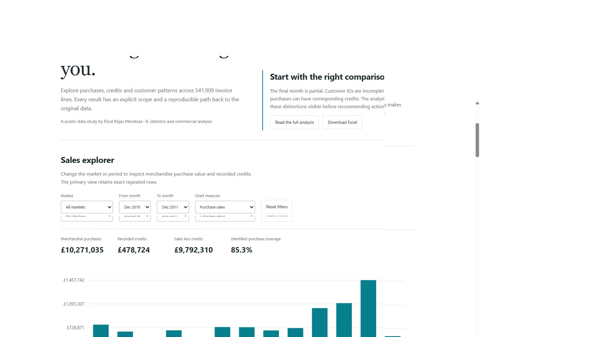
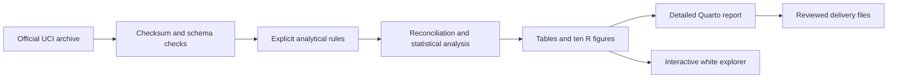
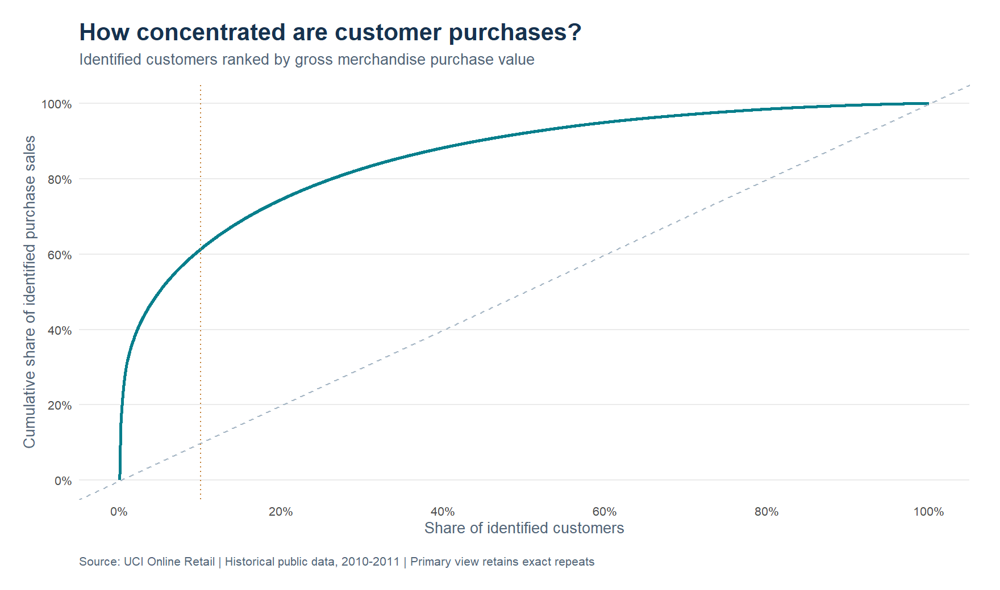
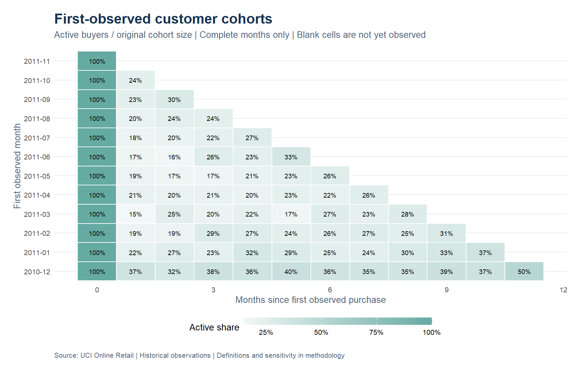

<div align="center">

# Retail Insights

Sales integrity, product credits and customer retention planning. A reproducible historical public-data portfolio study by Eliud Rojas Mendoza.

**541,909 invoice-line records · 3,914 merchandise codes · 4,334 identified buyers.**

[Explore the project](https://enybyy.github.io/retail-insights/) · [Full analytical report](https://enybyy.github.io/retail-insights/report.html) · [Portfolio](https://enybyy.github.io/)

<a href="https://enybyy.github.io/retail-insights/"></a>

<p><a href="https://github.com/Enybyy"></a>
<a href="https://www.linkedin.com/in/eliud-rojas-mendoza-414652212/"></a>
<a href="https://www.upwork.com/freelancers/~01471ca462b236e8e5"></a></p>

[](https://enybyy.github.io/retail-insights/)

*Actual local explorer screenshot. The page presents the complete historical public dataset described in the methodology.*

[](https://github.com/Enybyy/retail-insights/actions/workflows/analysis.yml)

</div>

## Reproduce in RStudio

Install R and RStudio, open `RetailInsights.Rproj` and restore the project environment. This study was executed with R 4.6.1. Quarto is bundled with recent RStudio installations.

```r
renv::restore(prompt = FALSE)
source("scripts/check_rules.R")
source("scripts/run_analysis.R")
```

From a terminal in the project directory:

```sh
Rscript scripts/check_rules.R
Rscript scripts/run_analysis.R
quarto render reports/retail-insights.qmd
python scripts/build_site.py
```

The R pipeline creates the aggregate tables, ten charts, verification record and explorer payload. The Python standard-library builder embeds that payload and bundles the rendered report and existing downloadable briefings. The Word/PDF and Excel deliverables are reviewed presentation snapshots of those results; they are not implicitly regenerated by the R command.

## Findings

- £10,271,034.61 in primary merchandise purchases and £478,724.18 in recorded credits or adjustments.
- The top 434 identified buyers account for 61.3% of identified purchase value; RFM identifies 384 at-risk buyers.
- 582 unique same-day purchase/credit candidate groups warrant investigation. The analysis does not assert a confirmed match.
- Repeated-line and candidate-exclusion policies are separate sensitivity views. No revenue, campaign benefit or profit is invented.

## What is included

- The complete original source is downloaded locally, verified with SHA-256 and kept separate from processed outputs.
- Ten publication-ready R figures, auditable aggregate CSV tables and a detailed Quarto report.
- A white, responsive explorer with functional filters, accessible SVG charts, tables and CSV exports.
- [Executive PDF](site/downloads/retail-insights-briefing.pdf), [editable Word briefing](site/downloads/retail-insights-briefing.docx) and [Excel analysis workbook](site/downloads/retail-insights-analysis.xlsx).
- Data dictionary, methodology, decision notes, a phased [delivery plan](docs/implementation-plan.md) and a [Spanish presentation guide](docs/presentation-guide-es.md).
- Package versions locked with `renv`; rule fixtures, reconciliation checks and continuous integration.

## Structure

```text
R/                 Analytical rules, statistics and charts
scripts/           Setup, source retrieval, checks and build commands
data/              Source manifest; raw/processed files kept locally
reports/           Quarto source, figures, aggregate tables and downloads
docs/              Methodology, dictionary, decisions and handover
site/              Self-contained explorer and publication bundle
renv.lock          Project-specific package versions
```

Individual source customer identifiers are not exported to the Retail public site. Raw files and dependency libraries are excluded from Git; all source observations remain available locally after download.

## Source and scope

Source: [UCI dataset and attribution](https://doi.org/10.24432/C5BW33), licensed under CC BY 4.0. Code is MIT-licensed. Source metadata and checksums are recorded in `data/source-manifest.json`.

This is an independent historical portfolio study, not a commissioned client engagement. Recommendations identify investigation and pilot opportunities; the data do not establish realised savings or causal effects. Read the report's definitions and limitations alongside the numerical findings.

## Analytical workflow



## Read the methodology

[Data dictionary](docs/data-dictionary.md) · [Methodology and limitations](docs/methodology.md) · [Phased delivery plan](docs/implementation-plan.md) · [Local setup in Spanish](docs/guia-local.md) · [Presentation guide in Spanish](docs/presentation-guide-es.md)

## Selected analytical views




