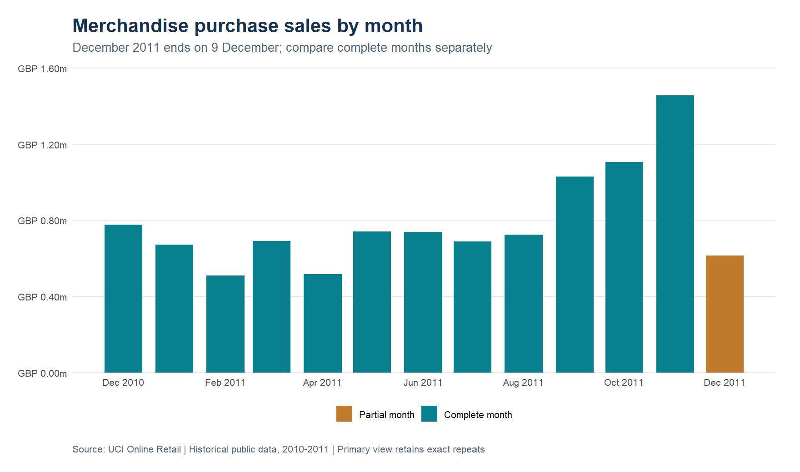

# Retail Insights

A reproducible R study of retail sales quality, credit notes and customer purchasing patterns using the public UCI Online Retail ledger.



## Run the analysis

Install R and RStudio, open `RetailInsights.Rproj`, and run these commands in the R console from the project root:

```r
source("scripts/setup.R")
source("scripts/check_rules.R")
source("scripts/run_analysis.R")
```

The setup restores the project library from `renv.lock`. On the first run it can download packages from CRAN. The pipeline retrieves the original Excel file, validates its checksum, generates tables and charts, and saves the report inputs. The source archive is about 24 MB.

To render the report with Quarto, open `reports/retail-insights.qmd` in RStudio and select **Render**, or run from a terminal:

```text
quarto render reports/retail-insights.qmd
```

RStudio includes Quarto in recent distributions. When Quarto is not on the terminal path, the RStudio Render action is the simplest option.

## Questions and first results

The study asks how ledger treatments affect reported sales, which products and countries concentrate purchasing, and how identified customers differ in purchase history.

The first verified run covers **541,909 source rows**, from **1 December 2010 to 9 December 2011**. It finds **5,268 exact repetitions** and **135,080 rows without customer IDs**. The primary view preserves exact repetitions because the file has no unique invoice-line identifier. A separate sensitivity view measures their effect.

Merchandise purchase lines total **GBP 10,271,034.61**. Recorded merchandise credits and adjustments total **GBP 478,724.18**. These are explicitly scoped ledger amounts, not profit. Approximately **10% of identified buyers account for 61.3% of identified purchase sales**. Customer-level conclusions cover identified purchases only.

Removing exact repeats changes merchandise purchase sales by **GBP 24,213.74**. That sensitivity is reported separately rather than used as an undocumented cleaning decision.

## Analytical outputs

- Row-level issue flags and an exhaustive ledger classification.
- Reconciled monthly sales, credits, market rankings and product rankings.
- A review list of large purchases with possible same-day credit counterparts.
- RFM segmentation with tied values scored consistently.
- Customer concentration, identification coverage and duplicate sensitivity.
- A self-contained HTML report with findings, figures, methodology and recommended tests.

The analysis is a portfolio study using historical public data. Its recommendations have not been deployed in a business, and no realised revenue uplift or cost savings are claimed.

## Files

| Path | Purpose |
| --- | --- |
| `R/ledger.R` | Typed import, quality flags and row classification |
| `R/analysis.R` | Sales, credits, concentration, RFM and sensitivity |
| `R/charts.R` | Publication figures |
| `scripts/download_data.R` | Source acquisition and checksum verification |
| `scripts/check_rules.R` | Edge-case checks for classification and RFM |
| `scripts/run_analysis.R` | Complete analytical pipeline and reconciliation checks |
| `reports/retail-insights.qmd` | Report source |
| `reports/tables/` | Aggregate results; customer-level files stay local |
| `data/source-manifest.json` | Source attribution, retrieval metadata and checksum |
| `docs/` | Scope, dictionary, decisions, methodology and local run guide |
| `renv.lock` | Package versions |

## Interpretation boundaries

December 2011 is partial and should not be compared as a complete month. Negative quantities are credit or adjustment observations, not matched returns. Product eligibility is a documented code heuristic. RFM monetary value is gross purchases, not customer profitability. Low recency does not prove churn. Large purchase lines with possible reversals need invoice review before they inform product decisions.

## Verification

The pipeline checks source row count, ledger partitioning, signed amount reconciliation, monthly/country/product totals, customer segment coverage, date rules and duplicate sensitivity. The edge-case fixture checks anonymous purchases, repeated lines, price anomalies, cancellations and tied RFM scores. The most recent run status is in `reports/verification.json`.

## Data source and license

Chen, D. (2015). *Online Retail*. UCI Machine Learning Repository. [DOI 10.24432/C5BW33](https://doi.org/10.24432/C5BW33). The dataset is licensed under [CC BY 4.0](https://creativecommons.org/licenses/by/4.0/). See the [source page](https://archive.ics.uci.edu/dataset/352/online+retail).

The source file is downloaded during execution rather than stored in Git. This project transforms the original data through explicit classification and aggregation. Code is licensed under MIT; the original dataset retains its separate CC BY 4.0 license.
