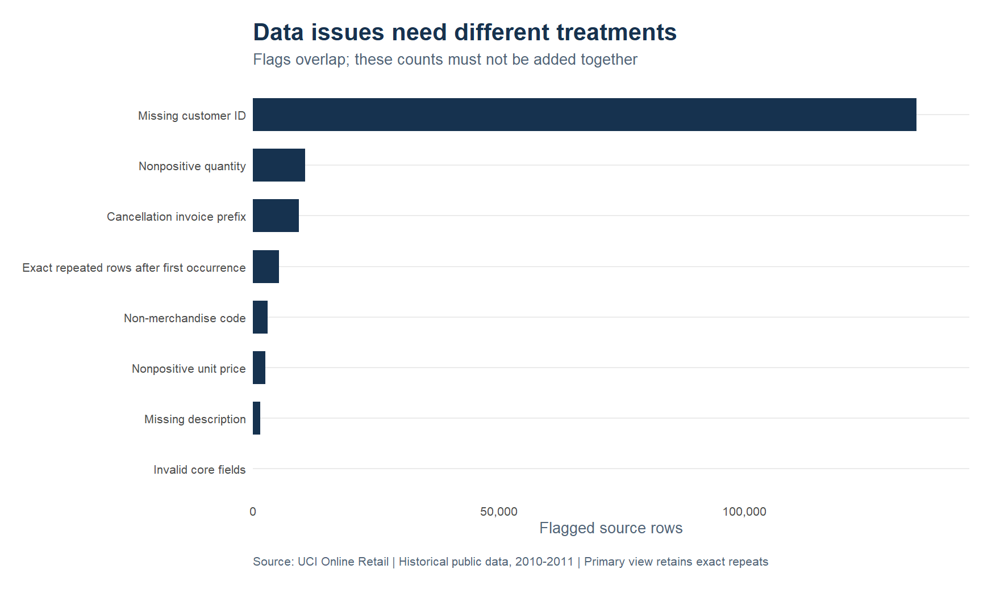
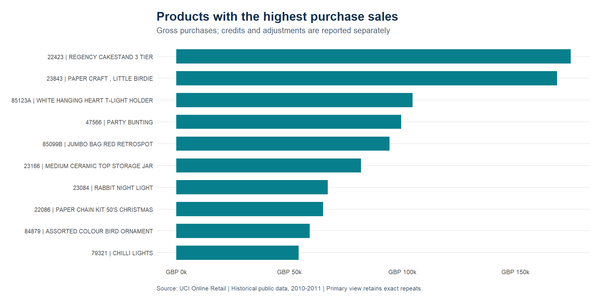
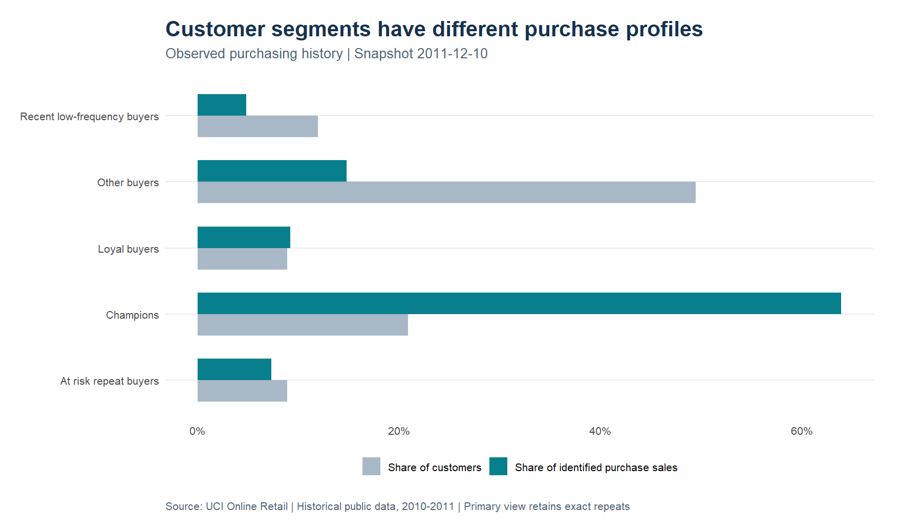
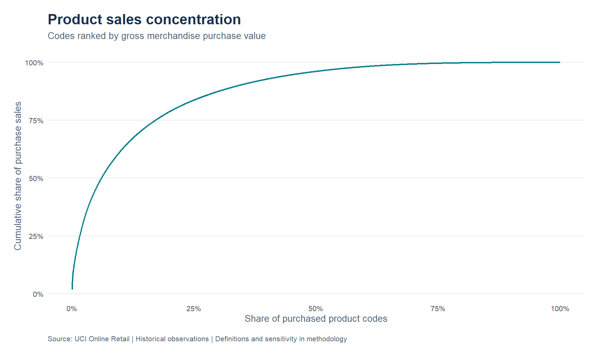
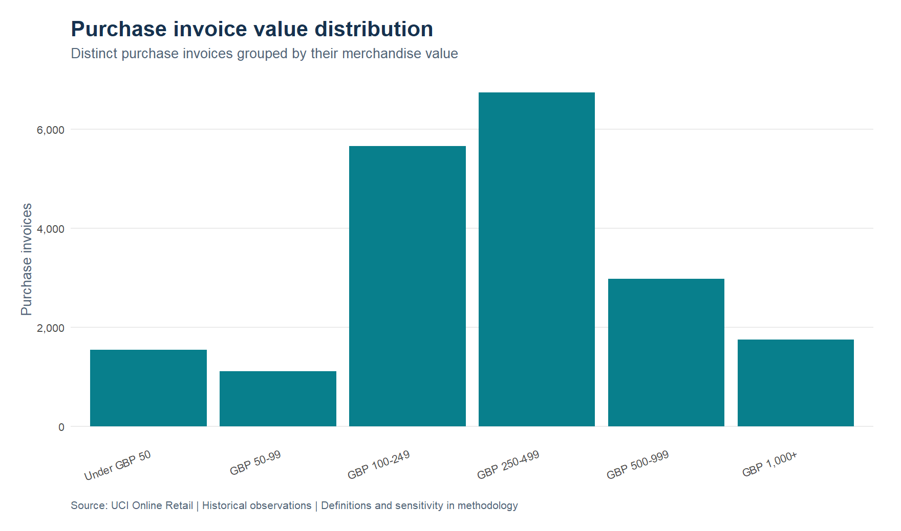
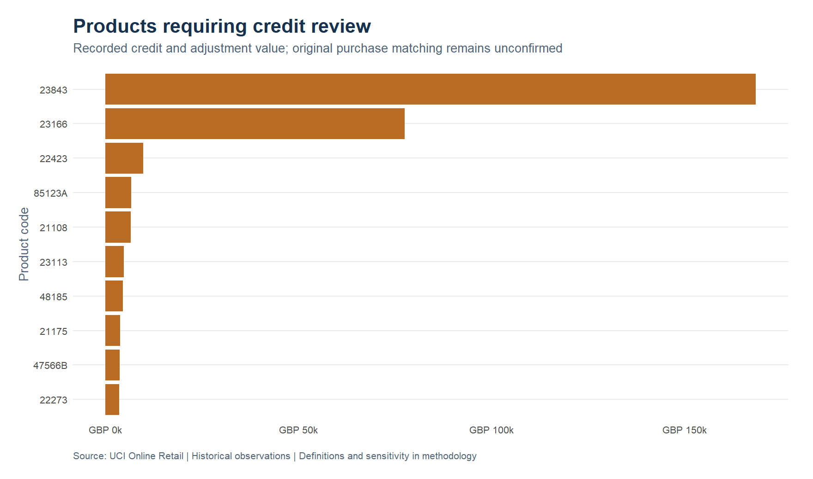
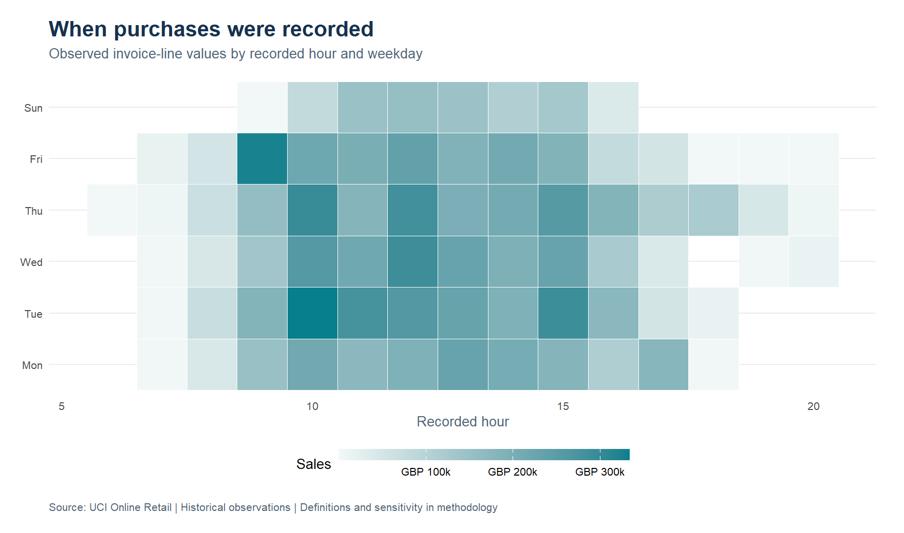

```{r}
results <- readRDS("../data/processed/results.rds")
advanced <- readRDS("../data/processed/advanced.rds")
m <- results$metrics
money <- function(x) paste0("GBP ", format(round(x, 2), big.mark = ",", nsmall = 2, scientific = FALSE, trim = TRUE))
count <- function(x) format(x, big.mark = ",", scientific = FALSE, trim = TRUE)
pct <- function(x) paste0(format(round(x * 100, 1), nsmall = 1, trim = TRUE), "%")
display_table <- function(data, digits = 2) {
  data[] <- lapply(data, function(x) {
    if (is.numeric(x)) {
      if (all(is.na(x) | x == trunc(x))) {
        format(x, big.mark = ",", scientific = FALSE, trim = TRUE)
      } else {
        format(round(x, digits), nsmall = digits, big.mark = ",", scientific = FALSE, trim = TRUE)
      }
    } else if (is.logical(x)) {
      ifelse(x, "Yes", "No")
    } else x
  })
  knitr::kable(data)
}
```

This study examines merchandise sales, data quality and customer purchasing patterns in a historical UK retail ledger. It separates purchase lines from recorded credits and administrative entries so that commercial comparisons have a clear scope. Customer findings describe identified buyers only; recommendations are proposed tests rather than measured business improvements.

The original file covers `r m$source_start` to `r m$source_end` and contains `r count(m$source_rows)` invoice lines. December 2011 is incomplete. The source is a public portfolio dataset, not a current client engagement.


## Findings from the first analysis

Gross merchandise purchase sales total **`r money(m$purchase_sales_gbp)`** across **`r count(m$purchase_orders)` purchase invoices**. Recorded merchandise credits and adjustments total **`r money(m$credit_value_gbp)`**. Their difference is **`r money(m$sales_less_recorded_credits_gbp)`** within this merchandise scope; it is not profit or a reconciled accounting revenue figure.

Customer identification covers **`r pct(m$identified_purchase_sales_share)`** of merchandise purchase sales. Among identified customers, the highest-spending `r count(m$top_10pct_customer_count)` buyers, approximately 10% of the customer base, account for **`r pct(m$top_10pct_identified_sales_share)`** of identified purchase value. This concentration supports prioritising account review, subject to margins, service costs and available capacity.

The RFM rules place **`r count(m$at_risk_buyers)`** repeat buyers in the low-recency group. This is a historical targeting hypothesis, not proof of churn. The dataset does not record communications, competitive purchases or reasons for inactivity.

## Data quality and ledger treatment

An invoice row is not an order. Invoice identifiers repeat across product lines. The audit flags overlapping issues first and then assigns every row to exactly one ledger class.



```{r}
audit <- results$category_audit
names(audit) <- c("Ledger class", "Rows", "Signed value GBP", "Repeated rows")
display_table(audit)
```

All original rows remain in the local source file. The primary view retains exact repetitions because there is no unique line identifier to establish whether they are accidental. A second view removes exact repeats after their first occurrence, making the sensitivity visible.

```{r}
sensitivity <- results$sensitivity
names(sensitivity) <- c("Policy", "Purchase rows", "Purchase sales GBP", "Credits GBP", "Sales less credits GBP", "Purchase difference GBP")
display_table(sensitivity)
```

Missing customer IDs do not remove purchases from sales totals. They do prevent customer-level analysis. Missing descriptions do not invalidate an item when its code and commercial fields are usable. Zero and negative prices are separated rather than silently treated as sales.

## Sales by period and market

Monthly amounts are observed totals, not seasonally adjusted estimates. Only complete observed months should be used for full-month comparisons. December 2010 and December 2011 also belong to different years and have different coverage.

```{r}
monthly <- results$monthly[, c("month", "purchase_sales_gbp", "credit_value_gbp", "sales_less_recorded_credits_gbp", "orders", "complete_month")]
names(monthly) <- c("Month", "Purchase sales GBP", "Credits GBP", "Sales less credits GBP", "Orders", "Complete month")
display_table(monthly)
```

The United Kingdom accounts for **`r pct(m$uk_purchase_sales_share)`** of merchandise purchase sales. Country fields are source labels; they do not establish customer residence or market size. These rankings describe this retailer's observed business.

```{r}
countries <- head(results$countries, 8)
countries$sales_share <- vapply(countries$sales_share, pct, character(1))
names(countries) <- c("Country", "Purchase sales GBP", "Orders", "Identified customers", "Sales share")
display_table(countries)
```

## Product priorities



The product ranking uses gross purchases. Credits are reported separately and are not reliably matched to their original purchases. A credit posted in this window may relate to a purchase outside it. Large credits therefore trigger an investigation rather than an automatic claim of a high return rate.

Product descriptions can vary for one code. The display uses its most frequent nonmissing description, resolving ties alphabetically. Merchandise candidates are codes with five digits followed by optional letters. Excluded codes are exported for manual review; this heuristic needs a product master before operational deployment.

### Large purchases and possible same day reversals

The following purchase lines require review before treating their product ranks as replenishment signals. A candidate credit shares the customer, product code, calendar day, absolute quantity and unit price. This is evidence of a possible reversal, not a confirmed invoice match. Candidate counts must not be used to subtract amounts: several purchase lines can point to the same credit.

```{r}
large <- head(results$large_lines, 5)[, c("invoice_no", "stock_code", "invoice_day", "Quantity", "line_value", "candidate_credit_lines")]
names(large) <- c("Purchase invoice", "Product code", "Date", "Quantity", "Purchase value GBP", "Candidate same day credits")
display_table(large)
```

The product export also includes purchase sales less all recorded credits for that code. That view complements gross purchase ranks but remains subject to the observation window and unmatched credit timing.

## Customer concentration and RFM segments


RFM uses recency in days, frequency as distinct purchase invoices and monetary value as gross merchandise purchases. The snapshot is **`r m$snapshot_day`**, one day after the final observed source date. Equal values receive equal scores; quintile groups may therefore have different sizes.



```{r}
segments <- results$segments
segments$customer_share <- vapply(segments$customer_share, pct, character(1))
segments$identified_sales_share <- vapply(segments$identified_sales_share, pct, character(1))
names(segments) <- c("Segment", "Customers", "Purchase sales GBP", "Median recency days", "Median orders", "Customer share", "Identified sales share")
display_table(segments)
```

Champions have high recency, frequency and monetary scores. At-risk repeat buyers have a recency score of at most two and a frequency score of at least three. Loyal buyers have high frequency after the previous rules are applied. Recent low-frequency buyers have high recency and low frequency. Remaining buyers are grouped together. These rules are transparent labels for observed behaviour, not a validated churn model.

## Recommendations and how to evaluate them

### Credit candidates and sensitivity

The stricter matching review identifies **`r count(advanced$pair_summary$unique_candidate_pairs)`** groups with exactly one purchase and one same-day credit sharing customer, product, absolute quantity and price. Their purchase value totals **`r money(advanced$pair_summary$unique_candidate_purchase_value_gbp)`**. Another **`r count(advanced$pair_summary$ambiguous_groups)`** groups remain ambiguous. These are candidates for invoice review, not confirmed original-invoice links.

```{r}
policy <- advanced$customer_policy_sensitivity
policy$top10_sales_share <- vapply(policy$top10_sales_share, pct, character(1))
names(policy) <- c("Purchase policy", "Customers", "Identified purchase sales GBP", "At risk repeat buyers", "Top 10 percent sales share")
display_table(policy)
```

### Cohorts and repeat purchasing


Cohort entry is the first purchase visible in the file, not confirmed customer acquisition. Early cohorts can include customers acquired before December 2010. Each cell divides active buyers in that month by the original cohort size. A buyer can skip a month and return later; this is monthly purchasing activity rather than survival or a continuous subscription retention measure. Unobserved future months are blank, and the final partial month is excluded.

### Product concentration and order composition





High sales concentration supports a shortlist for product review, but purchasing value does not reveal gross margin, replenishment lead time or availability. The full product table includes credit-only codes and reconciles all merchandise credits; this corrects the purchased-product ranking's narrower scope.





These observed transaction times describe invoice recording, not delivery timing, staff workload or customer browsing. Saturday absence in the source must not be interpreted as evidence of zero potential demand.

### Decision tests

**Review credits before changing product strategy.** Start with large negative lines and their invoice references, then obtain original invoices, reason codes and a product master. The useful outcome is a verified breakdown of returns, cancellations and corrections. The present file supports an investigation list, not attribution of causes.

**Test retention activity on eligible repeat buyers.** Refresh the transaction history before using the historical RFM rules, check contact permission and separate campaign participants from a comparable holdout group. Measure incremental repeat orders and contribution after discounts and contact costs over a defined period. This study estimates no realised uplift.

**Review concentration with account economics.** Combine high purchase value with margin, fulfilment cost and credit history before prioritising service. High sales alone do not establish profitability or justify a promotion.

**Improve customer identification where appropriate.** Examine why customer IDs are missing and which ordering channels are involved. Measure identification coverage and subsequent reporting completeness. Do not invent customer identities or merge anonymous purchases without evidence.

## Reproducibility and checks

`scripts/download_data.R` retrieves the original file and validates its SHA-256 against the source manifest. `scripts/run_analysis.R` reads the source with explicit field types, builds the ledger, generates aggregate tables and charts, and saves report inputs.

The run checks that ledger classes partition all source rows, signed class totals reconcile to the ledger, monthly/country/product sales reconcile to the purchase total, segment totals reconcile to identified purchases, recency and frequency are valid, and the partial final month is flagged. Duplicate sensitivity is checked separately. Detailed edge-case checks cover classification and scoring rules.

Report figures and values are regenerated from saved R results. Package versions are recorded in `renv.lock`; run-specific information is saved in `reports/session-info.txt`. Customer-level extracts remain local by default.

## Source and limitations

Chen, D. (2015). *Online Retail*. UCI Machine Learning Repository. [Dataset DOI](https://doi.org/10.24432/C5BW33). Licensed under [CC BY 4.0](https://creativecommons.org/licenses/by/4.0/). The analysis applies transformations, classifications and aggregations to the original file.

The dataset is historical and covers one retailer. It includes no costs, inventory positions, marketing exposure or campaign outcomes. Invoice timestamps have no documented timezone. The analysis preserves their recorded calendar day; it does not convert them to local time. Credit matching, duplicate interpretation and merchandise classification remain explicit limitations.
